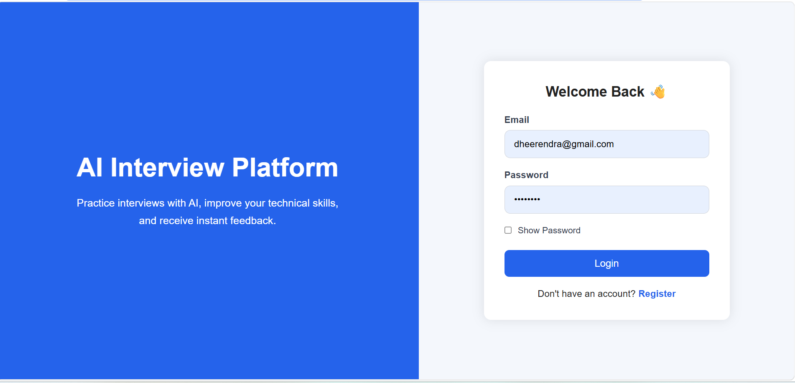
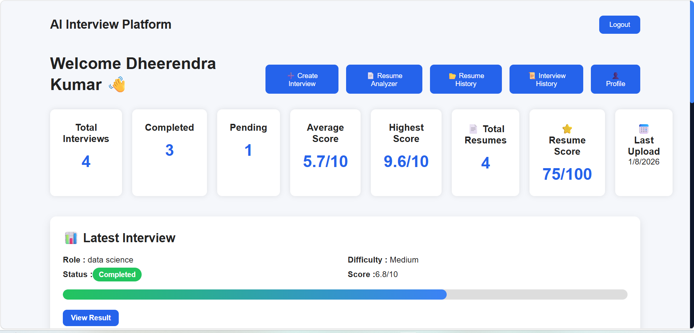
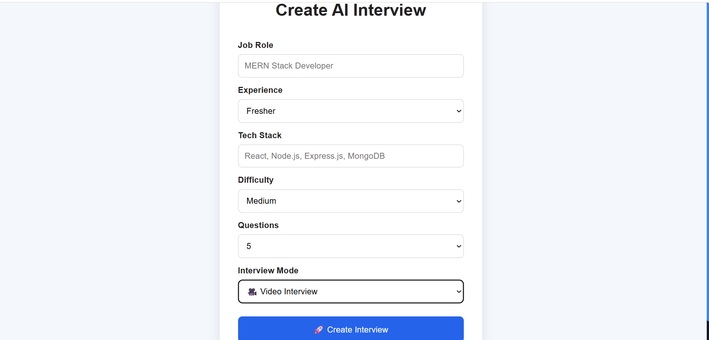
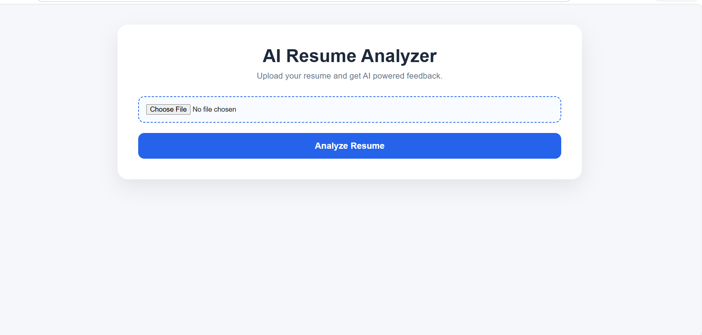

# 🤖 AI Interview Platform

An AI-powered Full Stack MERN application that helps users practice technical interviews, analyze resumes, and improve interview performance using Google's Gemini AI.


---

## 🚀 Live Demo

🌐 **Frontend:** https://ai-interview-topaz-three.vercel.app

⚙️ **Backend API:** https://ai-interview-backend-puxa.onrender.com

---

# 📸 Screenshots

## 🔐 Login Page



---

## 📊 Dashboard



---

## 🎯 Create AI Interview



---

## 📄 AI Resume Analyzer



---

# ✨ Features

- 🔐 Secure User Authentication (JWT)
- 🤖 AI-powered Interview Question Generation
- 📄 AI Resume Analyzer
- 📹 Video Interview Mode
- 📊 Interview Dashboard & Analytics
- 📝 Interview History
- 📂 Resume History
- 👤 User Profile Management
- 📁 PDF Resume Upload
- ⚡ Responsive Modern UI

---

# 🛠 Tech Stack

### Frontend

- React.js
- React Router
- Axios
- CSS3

### Backend

- Node.js
- Express.js
- MongoDB
- Mongoose
- JWT Authentication
- Multer
- PDF-Parse

### AI

- Google Gemini API

### Deployment

- Vercel
- Render

---

# 📂 Project Structure

```
Ai-Interview
│
├── client
├── server
├── screenshots
│   ├── login.png
│   ├── dashboard.png
│   ├── create-interview.png
│   └── resume-analyzer.png
│
└── README.md
```

---

# ⚙️ Installation

### Clone Repository

```bash
git clone https://github.com/dheerendrakumar63/Ai-Interview.git
```

### Go to Project

```bash
cd Ai-Interview
```

### Backend

```bash
cd server
npm install
npm run dev
```

### Frontend

```bash
cd client
npm install
npm run dev
```

---

# 🔑 Environment Variables

Create a `.env` file inside the **server** folder.

```env
PORT=5000

MONGO_URI=your_mongodb_connection_string

JWT_SECRET=your_secret_key

GEMINI_API_KEY=your_gemini_api_key
```

---

# 📌 Future Improvements

- 🎙 Voice Interview
- 📹 Webcam Monitoring
- 🌙 Dark Mode
- 📈 Performance Analytics
- 📧 Email Reports
- 🏆 Leaderboard
- 💼 Company-wise Interview Sets

---

# 👨‍💻 Author

**Dheerendra Kumar**

- GitHub: https://github.com/dheerendrakumar63
- LinkedIn: https://www.linkedin.com/in/dheerendra-kumar-359b4038a

---

## ⭐ Support

If you like this project, don't forget to ⭐ the repository.